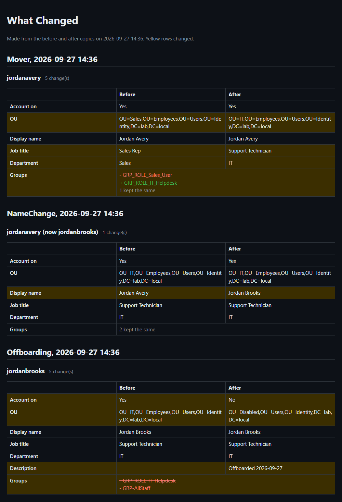

# AD and Microsoft 365 Automation

[](https://github.com/AlexisRodriguezCS/ad-m365-automation/actions/workflows/ci.yml)

PowerShell scripts for the account work IT does every week: new hires, role changes, name changes
and people leaving. They work with Active Directory and Microsoft 365. There are also checks for
security, licenses and cleanup that usually get done by hand, or get skipped.

Every script works the same way:

- **Nothing changes unless you add `-Apply`.** Without it, the script only shows what it would do.
- **It saves a copy of the account before changing it**, so a mistake can be undone.
- **If something fails, the report says who and why**, at the top.

HR can request changes through a SharePoint list, or IT can run any script by hand.

It's built for a **hybrid** setup: users are created in Active Directory, then Entra Connect copies
them to Microsoft 365, where their license, mailbox and OneDrive live. For a client with no
Microsoft 365, set `"Environment": "OnPrem"` and the scripts skip the cloud steps.

```
On-prem AD --(Entra Connect sync)--> Entra ID --> Exchange Online / OneDrive / Licenses
  accounts, groups, OUs                                 mailboxes, DLs, files
```

---

## See it run

The demo takes one made-up employee through everything: hired, promoted, name change after getting
married, leaving the company, and then undoing the offboarding. It runs on a real Windows Server 2025
domain controller built for this project.

```powershell
.\Demo\Invoke-Demo.ps1 -Client Lab -Apply
```

After each step it reads the account back from Active Directory and prints it, so the output shows
what is really in AD, not what the script thinks it did. This is a real run on the lab DC:

```
 1. HIRED
      Name     : Jordan Avery   (jordanavery)
      Job      : Sales Rep, Sales
      Enabled  : True
      Where    : OU=Sales,OU=Employees,OU=Users,OU=Identity
      Access   : GRP_ROLE_Sales_User, GRP-AllStaff

 2. PROMOTED
      Name     : Jordan Avery   (jordanavery)
      Job      : Support Technician, IT   <- changed
      Enabled  : True
      Where    : OU=IT,OU=Employees,OU=Users,OU=Identity   <- changed
      Access   : GRP_ROLE_IT_Helpdesk, GRP-AllStaff   <- changed

 3. NAME CHANGE
      Name     : Jordan Brooks   (jordanbrooks)   <- changed
      Job      : Support Technician, IT
      Enabled  : True
      Where    : OU=IT,OU=Employees,OU=Users,OU=Identity
      Access   : GRP_ROLE_IT_Helpdesk, GRP-AllStaff

 4. LEAVING
      Name     : Jordan Brooks   (jordanbrooks)
      Job      : Support Technician, IT
      Enabled  : False   <- changed
      Where    : OU=Disabled,OU=Users,OU=Identity   <- changed
      Access   : none   <- changed

 5. UNDO
      Name     : Jordan Brooks   (jordanbrooks)
      Job      : Support Technician, IT
      Enabled  : True   <- changed
      Where    : OU=IT,OU=Employees,OU=Users,OU=Identity   <- changed
      Access   : GRP_ROLE_IT_Helpdesk, GRP-AllStaff   <- changed
```

<details>
<summary>The full output of that run (the temporary password is hidden)</summary>

```
  Employee lifecycle demo - Lab
  LIVE: this will change Active Directory
  This client is Active Directory only, so every Microsoft 365 step is skipped.
  Output: C:\scripts\Demo\Output\Demo_20260927_143627

======================================================================
 1. HIRED
 HR sends a new starter. Account, right department, right access, temporary password.
======================================================================
[66276ef5] [Import-OnboardingCsv] Import -> Jordan Avery : Imported
--------------------------------------------------------
[66276ef5] [ConvertTo-OnboardingStandard] Normalize -> Jordan Avery: FirstName=Jordan, LastName=Avery, Title=Sales Rep, Manager=, Location=, Department=Sales
[66276ef5] [Test-OnboardingData] Validation -> Jordan Avery: Valid
[66276ef5] [Set-OnboardingPolicy] Policy -> Jordan Avery : DL=Sales;AllStaff | Groups=GRP_ROLE_Sales_User;GRP-AllStaff | License=
[66276ef5] [New-OnboardingPlan] AddToGroup -> GRP_ROLE_Sales_User : PENDING
[66276ef5] [New-OnboardingPlan] AddToGroup -> GRP-AllStaff : PENDING
[66276ef5] [New-OnboardingIdentity] SamAccountName -> jordanavery : GENERATED
[66276ef5] [New-OnboardingIdentity] UPN -> jordanavery@lab.local : GENERATED
[66276ef5] [New-OnboardingIdentity] OU -> OU=Sales,OU=Employees,OU=Users,OU=Identity,DC=lab,DC=local : GENERATED
[66276ef5] [New-OnboardingUser] CreateUser -> jordanavery : CREATED
--------------------------------------------------------
On-prem client: no Entra sync needed.
[66276ef5] AddToGroup -> GRP_ROLE_Sales_User : Added to GRP_ROLE_Sales_User
[66276ef5] AddToGroup -> GRP-AllStaff : Added to GRP-AllStaff

    === Pipeline Finished ===
    Total: 1
    Created: 1
    Already Exists: 0
    Failed: 0
    Stopped: 0
    Total Duration: 0.3529094 sec
Report generated: C:\scripts\Onboarding\Functions\..\..\Reports\OnboardingReport_20260927_143628.txt

=== Sign-in details (shown once: access pass for day one, temp password must be changed) ===

Name         Username              TempPassword     TemporaryAccessPass
----         --------              ------------     -------------------
Jordan Avery jordanavery@lab.local (hidden here) 

      AddToGroup -> GRP_ROLE_Sales_User : Added to GRP_ROLE_Sales_User
      AddToGroup -> GRP-AllStaff : Added to GRP-AllStaff
      (skipped, this client has no Microsoft 365: Entra sync, Microsoft 365 license, mailbox, distribution lists, day-one access pass)
   ... 0.5s
   After hiring:
      Name     : Jordan Avery   (jordanavery)
      Job      : Sales Rep, Sales
      Enabled  : True
      Where    : OU=Sales,OU=Employees,OU=Users,OU=Identity
      Access   : GRP_ROLE_Sales_User, GRP-AllStaff

======================================================================
 2. PROMOTED
 Moving to IT. Old access comes off, new access goes on, and they move department.
======================================================================
[d758178e] [New-MoverRequest] Request -> jordanavery : IT / Support Technician / Technician
--------------------------------------------------------
[d758178e] [Test-MoverData] Validation -> jordanavery: Valid
[d758178e] [Get-MoverIdentity] Lookup -> jordanavery : FOUND (CN=Jordan Avery,OU=Sales,OU=Employees,OU=Users,OU=Identity,DC=lab,DC=local)
[d758178e] [Set-OnboardingPolicy] Policy -> jordanavery : DL=IT;AllStaff | Groups=GRP_ROLE_IT_Helpdesk;GRP-AllStaff | License=
[d758178e] [New-MoverPlan] SetAttribute -> Title: 'Sales Rep' -> 'Support Technician' : PENDING
[d758178e] [New-MoverPlan] SetAttribute -> Department: 'Sales' -> 'IT' : PENDING
[d758178e] [New-MoverPlan] AddToGroup -> GRP_ROLE_IT_Helpdesk : PENDING
[d758178e] [New-MoverPlan] RemoveFromGroup -> CN=GRP_ROLE_Sales_User,OU=Groups,OU=Identity,DC=lab,DC=local : PENDING
[d758178e] [New-MoverPlan] MoveToDepartmentOU -> OU=IT,OU=Employees,OU=Users,OU=Identity,DC=lab,DC=local : PENDING
[d758178e] SetAttribute -> Title : 'Sales Rep' is now 'Support Technician'
[d758178e] SetAttribute -> Department : 'Sales' is now 'IT'
[d758178e] AddToGroup -> GRP_ROLE_IT_Helpdesk : Added to GRP_ROLE_IT_Helpdesk
[d758178e] RemoveFromGroup -> CN=GRP_ROLE_Sales_User,OU=Groups,OU=Identity,DC=lab,DC=local : Removed from CN=GRP_ROLE_Sales_User,OU=Groups,OU=Identity,DC=lab,DC=local
[d758178e] MoveToDepartmentOU -> OU=IT,OU=Employees,OU=Users,OU=Identity,DC=lab,DC=local : Moved
--------------------------------------------------------
=== Pipeline Finished === Total: 1 | Moved: 1 | Failed: 0 | Duration: 0.1786934 sec
Report generated: C:\scripts\Mover\Functions\..\..\Reports\MoverReport_20260927_143628.txt
      SetAttribute -> Title : 'Sales Rep' is now 'Support Technician'
      SetAttribute -> Department : 'Sales' is now 'IT'
      AddToGroup -> GRP_ROLE_IT_Helpdesk : Added to GRP_ROLE_IT_Helpdesk
      RemoveFromGroup -> GRP_ROLE_Sales_User: Removed from GRP_ROLE_Sales_User
      MoveToDepartmentOU -> OU=IT: Moved
      (skipped, this client has no Microsoft 365: swapping the department distribution lists and the role's Microsoft 365 license)
   ... 0.3s
   After the role change:
      Name     : Jordan Avery   (jordanavery)
      Job      : Support Technician, IT   <- changed
      Enabled  : True
      Where    : OU=IT,OU=Employees,OU=Users,OU=Identity   <- changed
      Access   : GRP_ROLE_IT_Helpdesk, GRP-AllStaff   <- changed

======================================================================
 3. NAME CHANGE
 They got married. New name, new username, and mail to the old address still arrives.
======================================================================
[11b428fc] [New-NameChangeRequest] Request -> jordanavery :  Brooks
[11b428fc] [Test-NameChangeData] Validation -> jordanavery: Valid
[11b428fc] [Get-NameChangeIdentity] Lookup -> jordanavery : FOUND (Jordan Avery -> Jordan Brooks)
[11b428fc] [New-NameChangePlan] RenameAccount -> Jordan Brooks : PENDING
[11b428fc] [New-NameChangePlan] ChangeLogonName -> jordanbrooks : PENDING
[11b428fc] [New-NameChangePlan] UpdateEmail -> jordanbrooks@lab.local : PENDING
[11b428fc] RenameAccount -> Jordan Brooks : Jordan Avery is now Jordan Brooks
[11b428fc] ChangeLogonName -> jordanbrooks : jordanavery@lab.local is now jordanbrooks@lab.local
[11b428fc] UpdateEmail -> jordanbrooks@lab.local : Set to jordanbrooks@lab.local (had no address before)
=== Pipeline Finished === Total: 1 | Renamed: 1 | Duration: 0.1194775 sec
      RenameAccount -> Jordan Brooks : Jordan Avery is now Jordan Brooks
      ChangeLogonName -> jordanbrooks : jordanavery@lab.local is now jordanbrooks@lab.local
      UpdateEmail -> jordanbrooks@lab.local : Set to jordanbrooks@lab.local (had no address before)
      (skipped, this client has no Microsoft 365: pushing the new name to Microsoft 365 straight away instead of waiting for the next sync)
   ... 0.2s
   After the name change:
      Name     : Jordan Brooks   (jordanbrooks)   <- changed
      Job      : Support Technician, IT
      Enabled  : True
      Where    : OU=IT,OU=Employees,OU=Users,OU=Identity
      Access   : GRP_ROLE_IT_Helpdesk, GRP-AllStaff

======================================================================
 4. LEAVING
 Last day. Locked out, access stripped, moved to the leavers area.
======================================================================
[1cd6563b] [Import-OffboardingCsv] Import -> jordanbrooks : Imported
--------------------------------------------------------
[1cd6563b] [Test-OffboardingData] Validation -> jordanbrooks: Valid
[1cd6563b] [Get-OffboardingIdentity] Lookup -> jordanbrooks : FOUND (CN=Jordan Brooks,OU=IT,OU=Employees,OU=Users,OU=Identity,DC=lab,DC=local)
[1cd6563b] [New-OffboardingPlan] DisableAccount -> jordanbrooks : PENDING
[1cd6563b] [New-OffboardingPlan] RemoveFromGroup -> CN=GRP_ROLE_IT_Helpdesk,OU=Groups,OU=Identity,DC=lab,DC=local : PENDING
[1cd6563b] [New-OffboardingPlan] RemoveFromGroup -> CN=GRP-AllStaff,OU=Groups,OU=Identity,DC=lab,DC=local : PENDING
[1cd6563b] [New-OffboardingPlan] MoveToDisabledOU -> OU=Disabled,OU=Users,OU=Identity,DC=lab,DC=local : PENDING
[1cd6563b] DisableAccount -> jordanbrooks : Disabled
[1cd6563b] RemoveFromGroup -> CN=GRP_ROLE_IT_Helpdesk,OU=Groups,OU=Identity,DC=lab,DC=local : Removed from CN=GRP_ROLE_IT_Helpdesk,OU=Groups,OU=Identity,DC=lab,DC=local
[1cd6563b] RemoveFromGroup -> CN=GRP-AllStaff,OU=Groups,OU=Identity,DC=lab,DC=local : Removed from CN=GRP-AllStaff,OU=Groups,OU=Identity,DC=lab,DC=local
[1cd6563b] MoveToDisabledOU -> OU=Disabled,OU=Users,OU=Identity,DC=lab,DC=local : Moved
--------------------------------------------------------

    === Pipeline Finished ===
    Total: 1
    Offboarded: 1
    Not Found: 0
    Failed: 0
    Stopped: 0
    Total Duration: 0.1313221 sec
Report generated: C:\scripts\Offboarding\Functions\..\..\Reports\OffboardingReport_20260927_143628.txt
      DisableAccount -> jordanbrooks : Disabled
      RemoveFromGroup -> GRP_ROLE_IT_Helpdesk: Removed from GRP_ROLE_IT_Helpdesk
      RemoveFromGroup -> GRP-AllStaff: Removed from GRP-AllStaff
      MoveToDisabledOU -> OU=Disabled: Moved
      (skipped, this client has no Microsoft 365: signing them out everywhere, wiping company data from their phone, handing the mailbox and OneDrive to their manager, out of office, hiding them from the address book, freeing the license)
   ... 0.2s
   After offboarding:
      Name     : Jordan Brooks   (jordanbrooks)
      Job      : Support Technician, IT
      Enabled  : False   <- changed
      Where    : OU=Disabled,OU=Users,OU=Identity   <- changed
      Access   : none   <- changed

======================================================================
 5. UNDO
 Wrong person. Put them back exactly as the before-snapshot recorded them.
======================================================================
[jordanbrooks] [Restore] EnableAccount -> jordanbrooks : PENDING
[jordanbrooks] [Restore] AddToGroup -> CN=GRP_ROLE_IT_Helpdesk,OU=Groups,OU=Identity,DC=lab,DC=local : PENDING
[jordanbrooks] [Restore] AddToGroup -> CN=GRP-AllStaff,OU=Groups,OU=Identity,DC=lab,DC=local : PENDING
[jordanbrooks] [Restore] MoveToOU -> OU=IT,OU=Employees,OU=Users,OU=Identity,DC=lab,DC=local : PENDING
[ea8d52d5] EnableAccount -> jordanbrooks : Enabled
[ea8d52d5] AddToGroup -> CN=GRP_ROLE_IT_Helpdesk,OU=Groups,OU=Identity,DC=lab,DC=local : Added back
[ea8d52d5] AddToGroup -> CN=GRP-AllStaff,OU=Groups,OU=Identity,DC=lab,DC=local : Added back
[ea8d52d5] MoveToOU -> OU=IT,OU=Employees,OU=Users,OU=Identity,DC=lab,DC=local : Moved
      EnableAccount -> jordanbrooks : Enabled
      AddToGroup -> GRP_ROLE_IT_Helpdesk: Added back
      AddToGroup -> GRP-AllStaff: Added back
      MoveToOU -> OU=IT: Moved
      (skipped, this client has no Microsoft 365: the license and mailbox type, which the report lists for a person to put back by hand)
   ... 0.1s
   After the undo:
      Name     : Jordan Brooks   (jordanbrooks)
      Job      : Support Technician, IT
      Enabled  : True   <- changed
      Where    : OU=IT,OU=Employees,OU=Users,OU=Identity   <- changed
      Access   : GRP_ROLE_IT_Helpdesk, GRP-AllStaff   <- changed
```
</details>

The same run as a web page (`changes.html`, made by [Rollback](Rollback/README.md)). Yellow rows changed:



<details>
<summary>The OUs that AD Structure built in the lab</summary>

```
lab.local
  Identity
    Computers
      Disabled
      Kiosks
      Laptops
      Workstations
    Groups
      Distribution
      Role
      Security
    Servers
      Application
      Database
      Infrastructure
    Users
      Contractors
      Disabled
      Employees
        Finance
        HR
        IT
        Marketing
        Sales
      ServiceAccounts
```
</details>

Each run saves a folder with all the reports, a copy of the account before and after, and everything
that was printed. See [Demo](Demo/README.md). The domain itself is built by [Lab](Lab/README.md) and
[AD Structure](ADStructure/README.md), so the whole setup can be rebuilt from scratch.

---

## Scripts

**People (Joiner, Mover, Leaver)**

| Script | What it does | One person or CSV |
|--------|--------------|:---:|
| [Onboarding](Onboarding/README.md) | New hire: AD account, groups, email lists, license, random temp password | Both |
| [Mover](Mover/README.md) | Role change: new title/department/manager, swap old access for new | Both |
| [User Attributes](UserAttributes/README.md) | Update details: title, phone, office, manager... only what changed | Both |
| [Name Change](NameChange/README.md) | Marriage or legal name change: new name, optional new username and email, old address kept as an alias | Both |
| [Offboarding](Offboarding/README.md) | Leaver: lock out, remove access, mailbox + OneDrive to manager, free licenses | Both |

**Scheduled**

| Script | What it does | When |
|--------|--------------|------|
| [HR Requests](Requests/README.md) | Processes approved requests from the SharePoint list, writes the result back | Every 15 min |
| [Password Expiry](PasswordExpiry/README.md) | Emails people before their password expires | Daily |
| [Mailbox Size Warnings](MailboxQuota/README.md) | Emails people before their mailbox fills up (80/90/95%, once a month per level) | Daily |
| [Inactive Accounts](InactiveAccounts/README.md) | Disables unused accounts, removes old guests (safety stop included) | Weekly |
| [Stale Devices](StaleDevices/README.md) | Retires Intune devices that stopped checking in, deletes very old records (safety stop included) | Weekly |
| [Audits](Audits/README.md) | Domain controller health (backups, replication, services, disks, time), GPO backups and changes, MFA gaps, admin roles, standing admins (PIM), risky users, Conditional Access changes (with backups), SPF/DKIM/DMARC, mail forwarding, ownerless groups, shared mailbox access, external sharing and stale guests, expiring app secrets, wasted licenses, access reviews, offboarding check | Weekly |

**IT tools** (run by hand)

| Script | What it does |
|--------|--------------|
| [AD Structure](ADStructure/README.md) | Builds a new client's OU tree and groups from a JSON file, and points new users and computers at real OUs so Group Policy can reach them |
| [Demo](Demo/README.md) | Runs one employee's whole story against the lab (hired, promoted, name change, leaver, undo) and collects every report and snapshot in one folder |
| [Compromised Account Response](IncidentResponse/README.md) | Collects evidence (inbox rules, sign-ins, MFA methods), then disables, resets, signs out, removes forwarding and malicious inbox rules |
| [Restore from Snapshot](Rollback/README.md) | Undoes a mistake: puts a user back the way their before-snapshot recorded (account, groups, attributes, OU) |
| [User Activity](UserActivity/README.md) | "My password doesn't work": one timeline of sign-ins, SSPR resets, lockouts and changes, with a plain-English summary of what went wrong |

**Other**: [Security](SECURITY.md) (secrets, permissions, guard rails) | [Lab](Lab/README.md) (build the test domain) | [Setup](Setup/) (certificate, secrets, scheduled tasks) | [Roadmap](ROADMAP.md)

---

## How it works

Every script follows the same pipeline and shares the same engine (`Modules/Shared`):

```
Input --> Validate --> Look up --> Plan --> Snapshot --> Execute (retries) --> Snapshot --> Report --> Alert
          bad rows                  only     before                              after       problems   Teams /
          skipped                   what                                                     first      email
                                    changed
```

**Dry run by default**
- Nothing changes without `-Apply`
- Dry run still validates, looks up and plans, so you see exactly what would happen

**Validate, then Plan, then Execute**
- Every row is validated before anything touches AD or M365
- Bad rows are skipped and reported, the rest keep going
- Each user gets a plan (list of actions) that is logged before it runs
- Only what's actually different is planned

**Retries**
- Each action has its own retry count and delay (e.g. waiting for Entra sync retries longer than a group add)
- Backoff grows each attempt, with jitter so parallel runs don't retry in lockstep
- Errors are classified (Network, Throttle, Auth, Conflict, Dependency) and flagged retryable or not
- Critical steps stop the plan if they fail (e.g. offboarding never strips access from an account it couldn't disable)

**Circuit breaker**
- If several people in a row fail (default 5, `MaxConsecutiveFailures`), the whole run stops instead of grinding through the rest
- That pattern means the system is down, the certificate expired or a permission was removed, not that one user is odd
- Everyone not reached is reported as **Stopped**, so nobody is silently skipped, and the alert fires
- Bad CSV rows and users that don't exist don't count: those are data problems, not an outage

**Idempotent (safe to re-run)**
- Checks before acting: user already exists, already in group, license already assigned, mailbox already shared
- No duplicate accounts, memberships, licenses or emails if a run is repeated
- A failed run can simply be run again

**Before / after snapshots**
- Before any change, the user's state is saved to JSON: enabled, OU, title, department, manager, groups, licenses, mailbox type
- Saved again after, in `Reports/Snapshots/`
- Audit trail of exactly what changed, and a way to undo mistakes

**Security** ([details](SECURITY.md))
- No passwords or client secrets: certificate sign-in, private key non-exportable, readable only by the service account (gMSA)
- Remaining secrets (e.g. Teams webhook) live in a vault; configs only hold a `secret:Name` reference
- Loaded secrets are masked as `***` in every log line
- CI scans the full git history for leaked secrets (gitleaks)
- Admin and VIP accounts can't be offboarded or moved from an HR request
- HR request approvals are verified from SharePoint's version history, not trusted
- A new hire never takes over an existing account unless the Employee ID matches

**Safety**
- Inactive accounts: stops if more than 10% of the tenant looks inactive
- Offboarding: disable first, licenses last (removing them before the mailbox is converted would delete it)
- Temp passwords are random, shown or emailed once, never logged or stored
- Only role groups (`GRP_ROLE_*`) are changed on a role change; hand-granted access is left alone

**Logging**
- **One file per day** per script: `Logs\Onboarding-2026-09-20.log`, so "what happened on the 14th" is one file
- A **`.jsonl` copy** beside it, one JSON object per line, for querying instead of grepping
- Every line carries a **run ID** (this execution) and a **correlation ID** (this person), so one batch or one user can be pulled out of a busy day
- The **client name** is on every JSON line, so a shared log file can be split per client
- Levels: DEBUG / INFO / WARN / ERROR, objects logged as JSON, step timings recorded per user
- Secrets loaded from the vault are masked as `***` in both files

```powershell
# every failed step for one client last Tuesday
Get-Content .\Onboarding\Logs\Onboarding-2026-09-15.jsonl |
    ConvertFrom-Json | Where-Object { $_.Level -eq "ERROR" -and $_.Client -eq "ClientA" }

# everything one run did
... | Where-Object RunId -eq "8f3a1c20"
```

**Retention**
- Reports and snapshots: **90 days** (they hold names, groups and managers)
- Logs: **365 days**
- Incident evidence and Conditional Access backups: kept, deliberately
- All handled by [`Setup/Remove-OldReports.ps1`](Setup/Remove-OldReports.ps1), scheduled weekly

**Flags anything that breaks**
- A user that can't be found, fails validation, or has an action fail after all retries is marked
- Every report starts with a **NEEDS ATTENTION** section listing those users and exactly what failed and why
- The run keeps going for everyone else; one bad user doesn't stop the batch
- Alert to Teams and/or email, and exit code 1, so a scheduler shows the run as failed

---

## Requirements

- PowerShell 7
- ActiveDirectory module (RSAT)
- Microsoft.Graph
- ExchangeOnlineManagement
- PnP.PowerShell (offboarding OneDrive handoff, request list setup)
- Microsoft.PowerShell.SecretManagement + a vault (SecretStore in the lab, Azure Key Vault in production)
- An Entra app registration with a certificate (app-only auth, no passwords): [`Setup/New-AutomationCertificate.ps1`](Setup/New-AutomationCertificate.ps1)
- Entra ID P1 for sign-in based checks (inactive accounts, MFA, idle licenses)

---

## Configuration

One folder per client: `Config/Clients/<Client>/<Script>.json` (gitignored, never committed).
For scheduled runs the folder can live outside the repo: set `SCRIPTS_CONFIG_ROOT`.

Settings every config can have:
```json
"AlertWebhookUrl": "secret:ClientA-TeamsWebhook",
"AlertEmail": "it-alerts@contoso.com",
"AlertSender": "automation@contoso.com",
"SecretVault": "AutomationVault",
"UseAdUpnForEntra": true,
"ProtectedAccounts": ["ceo", "breakglass"]
```

- `secret:Name` values are read from the vault at run time ([`Setup/Set-AutomationSecret.ps1`](Setup/Set-AutomationSecret.ps1) stores them)
- `UseAdUpnForEntra`: `true` when AD UPNs use your real domain (production); leave out in a `.local` lab
- `ProtectedAccounts`: usernames HR requests can never offboard or move (AD admins are always protected)

<details>
<summary>Onboarding.json (also used by Mover and User Attributes)</summary>

```json
{
    "Domain": "contoso.local",
    "UPNSuffix": "@contoso.local",
    "DefaultOU": "OU=Employees,OU=Users,OU=Identity,DC=contoso,DC=local",
    "GroupsOU": "OU=Role-Based,OU=Security,OU=Groups,DC=contoso,DC=local",
    "DepartmentOU": "OU=Employees,OU=Users,OU=Identity,DC=contoso,DC=local",
    "Departments": ["Finance", "IT", "Sales", "HR", "Marketing"],
    "ManagedGroupPrefix": "GRP_ROLE_",
    "UsernameFormat": "FirstLast",
    "DefaultLicense": "Microsoft365BusinessBasic",
    "DefaultDistributionList": "AllStaff",
    "DefaultGroups": ["GRP-AllStaff"],
    "MaxConsecutiveFailures": 5,
    "DistributionLists": ["AllStaff", "Managers", "Finance", "IT", "Sales", "HR", "Marketing"],
    "TenantDomain": "contoso.onmicrosoft.com",
    "TenantId": "00000000-0000-0000-0000-000000000000",
    "ClientId": "11111111-1111-1111-1111-111111111111",
    "CertThumbprint": "0000000000000000000000000000000000000000",
    "ADConnectServer": "CONTOSO-ADC01",
    "LicenseSkuId": "22222222-2222-2222-2222-222222222222",
    "UsageLocation": "US",
    "UseTemporaryAccessPass": true,
    "AccessPassLifetimeMinutes": 480
}
```
</details>

<details>
<summary>Offboarding.json</summary>

```json
{
    "DisabledOU": "OU=Disabled,OU=Users,OU=Identity,DC=contoso,DC=local",
    "DefaultContact": "helpdesk@contoso.com",
    "AutoReplyMessage": "{Name} is no longer with the company. Please contact {Contact}.",
    "MaxConsecutiveFailures": 5,
    "TenantDomain": "contoso.onmicrosoft.com",
    "SharePointAdminUrl": "https://contoso-admin.sharepoint.com",
    "TenantId": "00000000-0000-0000-0000-000000000000",
    "ClientId": "11111111-1111-1111-1111-111111111111",
    "CertThumbprint": "0000000000000000000000000000000000000000"
}
```
</details>

<details>
<summary>InactiveAccounts.json</summary>

```json
{
    "MemberInactiveDays": 90,
    "GuestInactiveDays": 90,
    "MaxPercentToDisable": 10,
    "ExcludeAccounts": ["breakglass@contoso.onmicrosoft.com", "svc-scanner@contoso.com"],
    "TenantDomain": "contoso.onmicrosoft.com",
    "TenantId": "00000000-0000-0000-0000-000000000000",
    "ClientId": "11111111-1111-1111-1111-111111111111",
    "CertThumbprint": "0000000000000000000000000000000000000000"
}
```
</details>

<details>
<summary>PasswordExpiry.json</summary>

```json
{
    "NotifyDays": [14, 7, 1],
    "SearchBase": "OU=Employees,OU=Users,OU=Identity,DC=contoso,DC=local",
    "SenderMailbox": "it-helpdesk@contoso.com",
    "PasswordResetUrl": "https://aka.ms/sspr",
    "EmailSubject": "Your password expires in {Days}",
    "EmailBody": "Hi {Name},\n\nYour password expires {Date} ({Days}).\nChange it here: {ResetUrl}\n\nIT Help Desk",
    "TenantId": "00000000-0000-0000-0000-000000000000",
    "ClientId": "11111111-1111-1111-1111-111111111111",
    "CertThumbprint": "0000000000000000000000000000000000000000"
}
```
</details>

<details>
<summary>Audits.json</summary>

```json
{
    "DefaultOU": "OU=Employees,OU=Users,OU=Identity,DC=contoso,DC=local",
    "MaxGlobalAdmins": 4,
    "BreakGlassAccounts": ["breakglass1@contoso.onmicrosoft.com", "breakglass2@contoso.onmicrosoft.com"],
    "CredentialWarningDays": 30,
    "InactiveDays": 90,
    "SharePointAdminUrl": "https://contoso-admin.sharepoint.com",
    "AllowedSharingDomains": ["vendor.com", "partner.com"],
    "ExternalUserMaxAgeDays": 365,
    "LicensePrices": { "O365_BUSINESS_ESSENTIALS": 6.00, "SPE_E3": 36.00 },
    "TenantDomain": "contoso.onmicrosoft.com",
    "TenantId": "00000000-0000-0000-0000-000000000000",
    "ClientId": "11111111-1111-1111-1111-111111111111",
    "CertThumbprint": "0000000000000000000000000000000000000000"
}
```
</details>

<details>
<summary>Requests.json</summary>

```json
{
    "SiteId": "contoso.sharepoint.com:/sites/HR",
    "ListName": "IT Requests",
    "SenderMailbox": "automation@contoso.com",
    "TempPasswordRecipient": "it-helpdesk@contoso.com",
    "Approvers": ["hr-lead@contoso.com", "it-manager@contoso.com"],
    "ProcessingTimeoutMinutes": 60,
    "RequestableGroups": ["GRP-Printers", "GRP-VPN", "GRP-Project-X"],
    "ProtectedAccounts": ["ceo", "breakglass"],
    "TenantDomain": "contoso.onmicrosoft.com",
    "TenantId": "00000000-0000-0000-0000-000000000000",
    "ClientId": "11111111-1111-1111-1111-111111111111",
    "CertThumbprint": "0000000000000000000000000000000000000000"
}
```
</details>

<details>
<summary>MailboxQuota.json</summary>

```json
{
    "WarnAtPercent": [80, 90, 95],
    "SenderMailbox": "it-helpdesk@contoso.com",
    "EmailSubject": "Your mailbox is {Percent}% full",
    "EmailBody": "Hi {Name},\n\nYour mailbox is {Percent}% full ({Used} of {Quota} GB).\nDelete or archive old mail so you don't stop receiving messages.\n\nIT Help Desk",
    "TenantDomain": "contoso.onmicrosoft.com",
    "TenantId": "00000000-0000-0000-0000-000000000000",
    "ClientId": "11111111-1111-1111-1111-111111111111",
    "CertThumbprint": "0000000000000000000000000000000000000000"
}
```
</details>

<details>
<summary>StaleDevices.json</summary>

```json
{
    "RetireAfterDays": 90,
    "DeleteAfterDays": 180,
    "MaxPercentToChange": 20,
    "ExcludeDevices": ["LOBBY-KIOSK", "CONF-ROOM-01"],
    "TenantId": "00000000-0000-0000-0000-000000000000",
    "ClientId": "11111111-1111-1111-1111-111111111111",
    "CertThumbprint": "0000000000000000000000000000000000000000"
}
```
</details>

<details>
<summary>IncidentResponse.json</summary>

```json
{
    "TenantDomain": "contoso.onmicrosoft.com",
    "TenantId": "00000000-0000-0000-0000-000000000000",
    "ClientId": "11111111-1111-1111-1111-111111111111",
    "CertThumbprint": "0000000000000000000000000000000000000000",
    "AlertEmail": "security@contoso.com"
}
```
</details>

<details>
<summary>UserActivity.json</summary>

```json
{
    "LockoutServer": "DC01.contoso.local",
    "Environment": "Hybrid",
    "TenantId": "00000000-0000-0000-0000-000000000000",
    "ClientId": "11111111-1111-1111-1111-111111111111",
    "CertThumbprint": "0000000000000000000000000000000000000000"
}
```

`Environment` set to `OnPrem` makes the script use `-SamAccountName` and skip Entra entirely.
</details>

Every config also takes `AlertWebhookUrl` / `AlertEmail` (see [Alerts](#how-it-works)) and `MaxConsecutiveFailures` for the circuit breaker. Secrets are written as `"secret:Name"` and read from the vault, never stored here.

---

## Tests

```powershell
Invoke-Pester ./Tests
```

AD, Graph, Exchange and PnP cmdlets are mocked, so tests run anywhere (including CI) without a tenant.
CI runs PSScriptAnalyzer and every test on each push.
